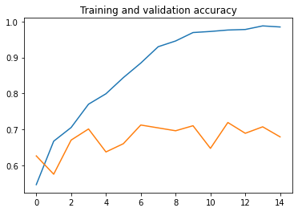
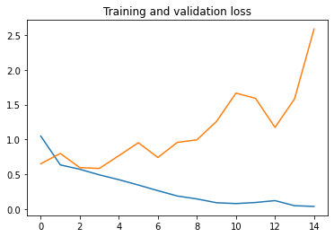

<div align="center">
  <h1>Notas de TensorFlow 2</h1>
</div>

# Contenido
- [Construir y entrenar un modelo de red neuronal usando TensorFlow 2](#Construir-y-entrenar-un-modelo-de-red-neuronal-usando-TensorFlow-2)
    - [Instalar TensorFlow 2 y Matplotlib](#Instalar-TensorFlow-2-y-Matplotlib)
    - [Construir, compilar y entrenar modelos de ML usando TensorFlow](#Construir-compilar-y-entrenar-modelos-de-ML-usando-TensorFlow)
    - [Predecir resultados](#Predecir-resultados)
    - [Construir modelo secuencial con multiples capas](#Construir-modelo-secuencial-con-multiples-capas)
    - [Construir modelo de clasificacion binaria](#Construir-modelo-de-clasificacion-binaria)
    - [Construir modelo de clasificacion multi clase](#Construir-modelo-de-clasificacion-multi-clase)

# Construir y entrenar un modelo de red neuronal usando TensorFlow 2

## Instalar TensorFlow 2 y Matplotlib

Para instalar la libreria de TensorFlow y Matplotlib en nuestra consola (dentro del entorno virtual) ejecutamos:

```
pip install tensorflow matplotlib
```

## Construir, compilar y entrenar modelos de ML usando TensorFlow

Para construir un modelo de ML para una regresión primero crearemos nuestros datos.

```python
X = -1, 0, 1, 2, 3, 4
Y = -3, -1, 1, 3, 5, 7
```

La solucion algebraica para los datos anteriores seria `y=2x-1`.

Ahora para crear un modelo que resuelva estos datos creamos una red simple y compilamos.

```python
model = keras.Sequential([keras.layers.Dense(units=1, input_shape=[1])])
model.compile(optimizer='sgd', loss='mean_squared_error')
```

La red debe recibir un numpy array para entrerar.

```python
xs = np.array([-1.0, 0.0, 1.0, 2.0, 3.0, 4.0], dtype=float)
ys = np.array([-3.0, -1.0, 1.0, 3.0, 5.0, 7.0], dtype=float)
```

Ahora entrenamos

```python
model.fit(xs, ys, epochs=500)
```

## Predecir resultados

Para predecir resultados tomamos nuestro modelo y ejecutamos el metodo `predict`.

```python
model.predict(X)
```

Esto nos devolvera el resultado.

## Construir modelo secuencial con multiples capas

El modelo secuencial se define con `Sequential` y la primera capa debe siempre llevar el `input_shape`.

```python
model = tf.keras.models.Sequential([
    tf.keras.layers.Dense(64, input_shape=[1]),
    tf.keras.layers.Dense(32),
    tf.keras.layers.Dense(1),
])
```

## Construir modelo de clasificacion binaria

El hecho de generar un modelo para clasificacion binaria implica que solo tendremos 2 valores de salida, por lo que el metodo de activacion por excelencia es el sigmoide.

```python
model = keras.Sequential([
    keras.layers.Flatten(input_shape=(28, 28)),
    keras.layers.Dense(128, activation='relu'),
    keras.layers.Dense(10, activation='sigmoid')
])
```

## Construir modelo de clasificacion multi clase

Para la clasificacion de multiclase cambiamos la activacion de la ultima capa por `softmax`.

```python
model = keras.Sequential([
    keras.layers.Flatten(input_shape=(28, 28)),
    keras.layers.Dense(128, activation='relu'),
    keras.layers.Dense(10, activation='softmax')
])
```

## Graficar perdida y certeza del modelo durante entrenamiento

Durante el entramiento podemos conservar la perdida y certeza de nuetro modelo, para ello lo asociamos a una variable.

```python
history = model.fit(xs, ys, epochs=500)
```

Separamos los valores de `accuracy` y `loss` en variables, y para tener la cantidad de `epochs` existente simplemente vemos el largo de las variables.

```python
acc      = history.history[     'accuracy' ]
val_acc  = history.history[ 'val_accuracy' ]
loss     = history.history[    'loss' ]
val_loss = history.history['val_loss' ]

epochs   = range(len(acc)) # Get number of epochs

#------------------------------------------------
# Plot training and validation accuracy per epoch
#------------------------------------------------
plt.plot  ( epochs,     acc )
plt.plot  ( epochs, val_acc )
plt.title ('Training and validation accuracy')
plt.figure()

#------------------------------------------------
# Plot training and validation loss per epoch
#------------------------------------------------
plt.plot  ( epochs,     loss )
plt.plot  ( epochs, val_loss )
plt.title ('Training and validation loss'   )
```

<div> 
  
  <br>
  
</div>